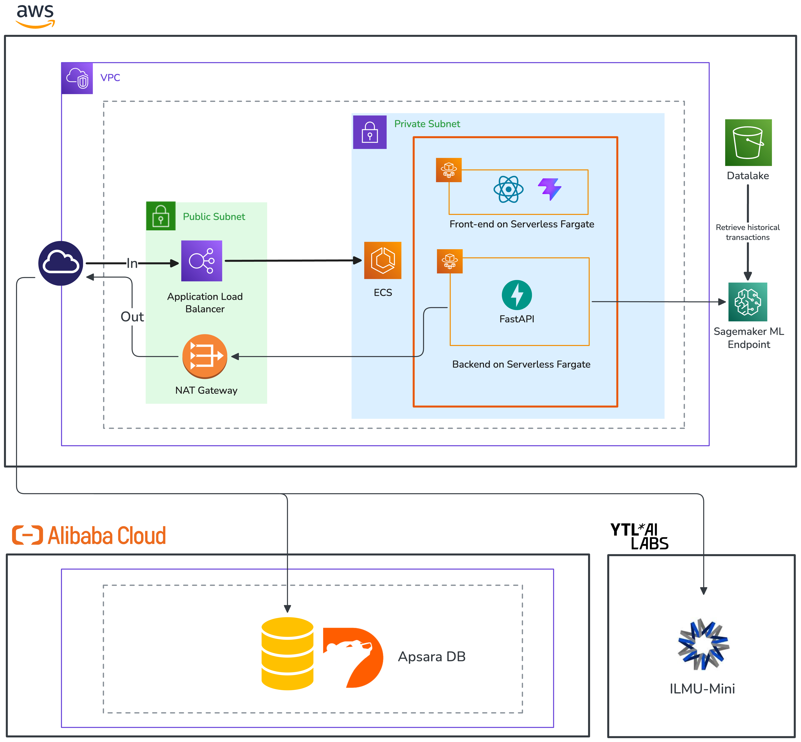

# ScamBusters — TNG FinHack 2026

> Pre-transaction scam detection for Malaysian consumers.  
> Paste a bank account, a suspicious link, or a chat export — get a risk verdict before you send the money.

**Live demo:** `http://scambuster-alb-399113752.ap-southeast-1.elb.amazonaws.com`

---

## The Problem

Existing fraud tools in Malaysia are reactive — they flag accounts *after* money has moved. Registry checks catch known mules, but miss first-time fraud. Rule-based thresholds apply the same limits to everyone, blocking legitimate power users while letting subtle scams through. And no single tool covers the full attack surface: mule accounts, scam links, and manipulative conversations all require different detection strategies.

---

## What ScamBusters Does

ScamBusters runs four independent fraud signals **before** a transaction is confirmed and combines them into a single verdict — `LOW`, `MEDIUM`, or `HIGH RISK`.

| Signal | What it checks |
|---|---|
| **National Fraud Portal** | Cross-references the recipient account against PayNet's NFP mule registry |
| **BNM Semak Mule** | Checks Bank Negara Malaysia's official mule account database |
| **Link Scanner** | Scrapes any URL the user submits, matches against a multilingual scam-keyword corpus (EN / BM / Manglish / Chinese), then runs LLM classification for scam type, regulatory exposure, and Malaysian localisation signals |
| **Behavioral Analysis** | Scores the transaction against the *specific user's* spending history using a rules engine (8 checks) and a per-user Isolation Forest ML model — flags what's anomalous for that individual, not a population average |

The final score is a noisy-OR combination of signal probabilities: one strong hit (e.g. a Semak Mule match) drives the verdict to High Risk on its own; multiple soft hits compound.

---

## Architecture


> **To update this image:** add your diagram as `docs/architecture.png` in the repo root and it will render here automatically.

**Deployment overview:**
- Frontend and backend each run as separate **AWS ECS Fargate** tasks behind an **Application Load Balancer**
- GitHub Actions builds Docker images on every push to `main`, pushes to Amazon ECR, and redeploys to ECS
- The behavioral ML service loads per-user Isolation Forest models lazily from **AWS S3** via a **SageMaker Multi-Model Endpoint**

### Multi-Cloud Architecture



---

## API Endpoints

All served from the consolidated backend at port 8000.

```
GET  /api/health

POST /api/v1/nfp/check                          NFP mule registry check
POST /api/v1/semakmule/check                    BNM Semak Mule check

POST /api/v1/fraud-scan/scan                    Scrape URL + LLM classify

POST /api/v1/behavioral/check-transaction       Score a transaction
GET  /api/v1/behavioral/user-profile/{user_id}  Get user spending profile
POST /api/v1/behavioral/simulate-transaction    Add transaction and rescore
```

---

## Demo Personas

Pre-seeded in the live deployment for demo and judging purposes.

| `user_id` | Name | Scenario | Verdict |
|---|---|---|---|
| `user_001` | Aisyah | RM4,800 to a new account at 23:47 — love-scam pattern | `CHALLENGE` |
| `user_002` | Ahmad | 5× RM2,000 within 10 min — phone-theft velocity burst | `CHALLENGE` |
| `user_003` | Wei | RM18 QR payment for bubble tea — normal behaviour | `ALLOW` |
| `user_004` | Mak Timah | RM8,000 to new account at 20:00 — PDRM impersonation | `CHALLENGE` |

---

## Repo Layout

```
.
├── backend/                  # Consolidated FastAPI — all services, port 8000
│   ├── api/v1/               # nfp, semakmule, fraud_scan, behavioral
│   ├── services/
│   │   ├── behavioral/       # rules_engine, feature_engineering, ml_model,
│   │   │                     #   risk_scorer, sagemaker_client
│   │   └── fraud_scan/       # scraper, classifier, keywords, prompts
│   ├── models/               # Pydantic schemas
│   ├── db/                   # SQLAlchemy + mule seed data
│   └── main.py
│
├── frontend/                 # React 19 + Vite + Tailwind, port 5173 (dev)
│   └── src/
│       ├── pages/            # Landing, Check, Checking, Report, Dashboard,
│       │                     #   About, DemoTransfer, DemoLinks
│       ├── components/
│       └── lib/              # api.ts, mockReport.ts, dashboardStore.ts
│
├── ci/
│   ├── docker/               # Dockerfiles for backend and frontend
│   └── task-definitions/     # ECS task definitions
│
├── .github/workflows/        # GitHub Actions CI/CD pipeline
├── docs/                     # Place architecture.png here
└── archive/                  # Original per-service folders (reference only)
```

---

## Running Locally

**Prerequisites:** Python 3.11+, Node 20+

```bash
# Backend
pip install -e backend/
playwright install chromium --with-deps
python -m backend.db.seed      # seed mule database (one-time)
cp .env.example .env            # fill in LLM + AWS keys
uvicorn backend.main:app --port 8000 --reload

# Frontend (separate terminal)
cd frontend && npm install && npm run dev
```

Open <http://localhost:5173>.

---

## Environment Variables

```bash
# LLM classifier
LLM_API_KEY=
LLM_BASE_URL=
LLM_MODEL=ilmu-mini-v3

# Behavioral ML (AWS)
AWS_REGION=ap-southeast-1
S3_DATA_BUCKET=tngdfinhack-ml-model-store
S3_MODEL_BUCKET=tngdfinhack-ml-model-store
SAGEMAKER_ENDPOINT_NAME=layer3-isolation-forest-mme
SAGEMAKER_ROLE_ARN=arn:aws:iam::<account>:role/<role>

# Frontend (optional — localhost defaults are baked in)
VITE_API_URL=http://localhost:8000
```

---

## Tech Stack

| | |
|---|---|
| Frontend | React 19, TypeScript, Vite, Tailwind CSS, Framer Motion |
| Backend | FastAPI, Python 3.12, Pydantic v2, SQLAlchemy |
| ML | scikit-learn Isolation Forest, AWS SageMaker Multi-Model Endpoint, S3 |
| Scraping | Playwright (Chromium), Trafilatura, BeautifulSoup4 |
| LLM | OpenAI-compatible API (ilmu-mini-v3) |
| Infrastructure | AWS ECS Fargate, ECR, Application Load Balancer |
| CI / CD | GitHub Actions |

---

## Disclaimer

Hackathon prototype for TNG FinHack 2026. Not affiliated with Bank Negara Malaysia, PDRM, PayNet, or Touch 'n Go. Mock NFP and BNM Semak Mule responses are wire-format compatible with the real services but contain no real customer data.
